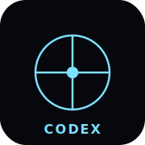

# CODEX

> A scripture terminal for the curious. Read 43+ translations, chase a word into the Talmud, the Nag Hammadi, and the gematria — then forge your own Bible in your own voice. Works offline. Opens in a tab.

<p align="center">
  
</p>

<p align="center">
  <em>Screenshot goes here — drop a <code>screenshot.png</code> next to <code>icon.svg</code> and swap this line.</em>
</p>

---

## What is this

CODEX is a Bible study app for people who follow footnotes for fun. It looks like a terminal, reads like a manuscript, and treats scripture as a thing worth interrogating from every angle — Hebrew, Greek, Aramaic, Coptic, Latin, English, and 38 more.

Open a verse. A column of companions wakes up: Talmudic parallels, patristic commentary, gematria, Strong's, cross-references, and — yes — the Gnostic mirror (Nag Hammadi, Pistis Sophia, Thomas). Nothing's hidden behind a paywall and nothing's flattened into devotional pablum. The weird canon is here on purpose.

Then there's **BabelForge** — a translation lab where you generate your own AI-translated edition of any book in any voice (1611 King James, beat poet, courtroom transcript, your bubbe). It's your Bible. Make it sound like you.

## Why CODEX

|                          | CODEX | YouVersion | Logos | Sefaria | Bible Gateway |
| ------------------------ | :---: | :--------: | :---: | :-----: | :-----------: |
| Open source              |   ✓   |     ✗      |   ✗   |    ✓    |       ✗       |
| Runs fully offline       |   ✓   |     ~      |   ~   |    ✗    |       ✗       |
| AI study companions      |   ✓   |     ✗      |   ~   |    ✗    |       ✗       |
| Talmud + Gnostic corpus  |   ✓   |     ✗      |   ~   |  partial|       ✗       |
| Build your own translation | ✓ |     ✗      |   ✗   |    ✗    |       ✗       |

(`~` = partial / paid tier)

## Features

### READ
- 43+ translations: KJV, ESV, WEB, BSB, LXX, Vulgate, Peshitta, Targumim, more
- Side-by-side compare (up to 4 columns)
- Red-letter mode, paragraph mode, interlinear toggle
- Cormorant serif for scripture, JetBrains Mono for the chrome
- Reels-style scripture cards for doomscrolling Psalms

### STUDY
- Strong's lookup on every word (Hebrew + Greek)
- Gematria panel — isopsephy, ordinal, mispar gadol
- Talmudic parallels and Jewish lectionary alignment
- Patristic + reformer commentary chain
- Cross-reference graph and verse maps (geographic)

### CREATE
- **BabelForge** — generate your own AI-translated Bible in any voice
- Notes, bookmarks, highlights with tag search
- Reading plans (chronological, canonical, custom)
- Export verses as cards, share as deep links

### DISCOVER
- **Oracle** chat — ask any question, get cited answers
- Gnostic + apocryphal panel: Nag Hammadi, Thomas, Pistis Sophia, Enoch
- Hebrew calendar, parsha tracker, daf yomi alignment
- "Walk this verse" — geographic verse maps via Leaflet

### OFFLINE
- Full PWA — install to home screen on any device
- Service worker caches every translation you open
- IndexedDB for notes, plans, your forged translations
- Works on a plane, in a tent, in a basement
- No build step — single HTML file, fork and go

## Getting started

```
git clone https://github.com/holasoyneto/codex
cd codex
node server.js
# open http://localhost:3000 — drop in your API key in Settings to enable AI panels
```

Or just open the hosted build: **https://holasoyneto.github.io/codex**

## Tech

Single-page React 18 app loaded via CDN with Babel-standalone — there is no build step, no bundler, no `node_modules` graveyard. Persistence lives in IndexedDB; offline lives in a Service Worker; translations stream from public-domain APIs and cache locally. The plugin system means every companion panel (gematria, Talmud, gnosis, Oracle) is a drop-in JSX module. Fork the repo, open `index.html`, and you're already running it.

## License

MIT. Take it, ship it, remix it, sell it. Just don't paywall the public domain.

## Acknowledgements

- Public-domain scripture from [bible-api.com](https://bible-api.com), [bolls.life](https://bolls.life), and [scrollmapper/bible_databases](https://github.com/scrollmapper/bible_databases)
- [Sefaria](https://www.sefaria.org) for the Jewish corpus model that inspired the parallel panel
- [Nag Hammadi Library](http://gnosis.org/naghamm/nhl.html) for the Coptic texts
- Fonts: [Cormorant](https://fonts.google.com/specimen/Cormorant) (SIL OFL) and [JetBrains Mono](https://www.jetbrains.com/lp/mono/) (SIL OFL)
- Maps via [Leaflet](https://leafletjs.com)
- Built for everyone who has ever stayed up until 3am chasing a footnote
